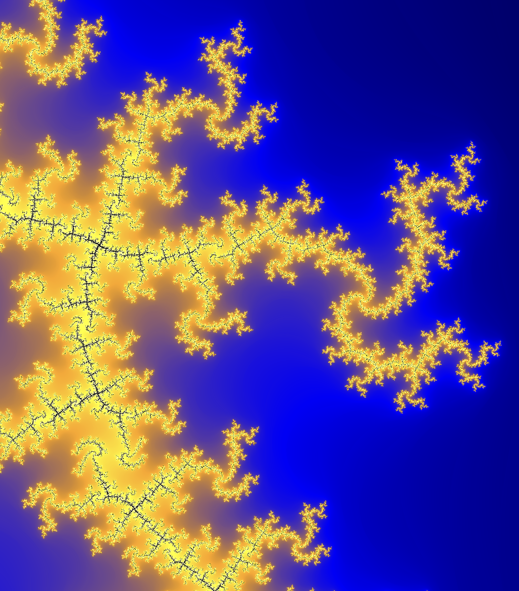

# Julia Fractal WebGPU Renderer


Only runs on mac os. Requires CMake, a C++ compiler, GLFW3.
```bash
git clone --recursive https://github.com/aleloi/juliagpu.git
mkdir build && cd build && cmake ../src && cmake --build . && cd -
./build/julia_fractal_webgpu
``` 


There is a seperate CUDA prototype that's "easy" to run if you have nix, linux, and a nvidia card: just do `nix run github:aleloi/juliagpu?dir=cuda_prototype --impure` without cloning.





