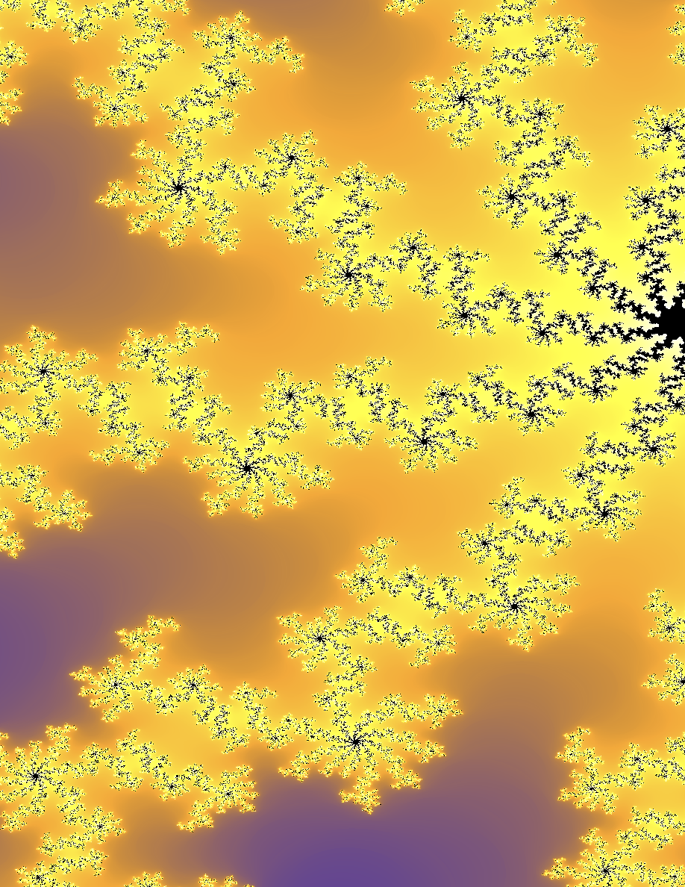
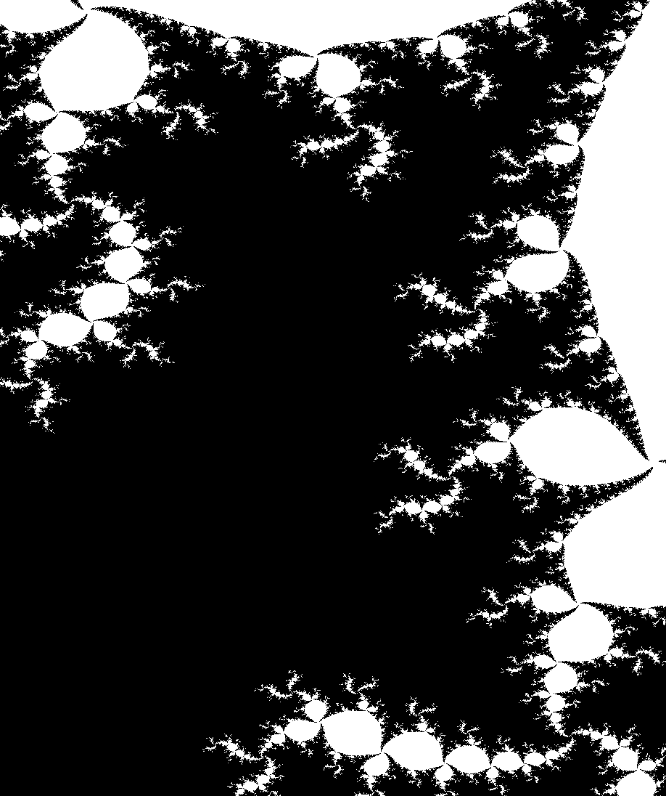
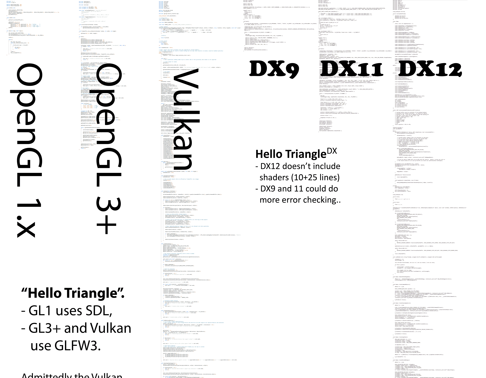
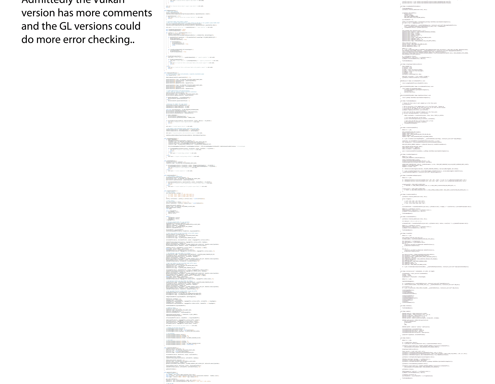
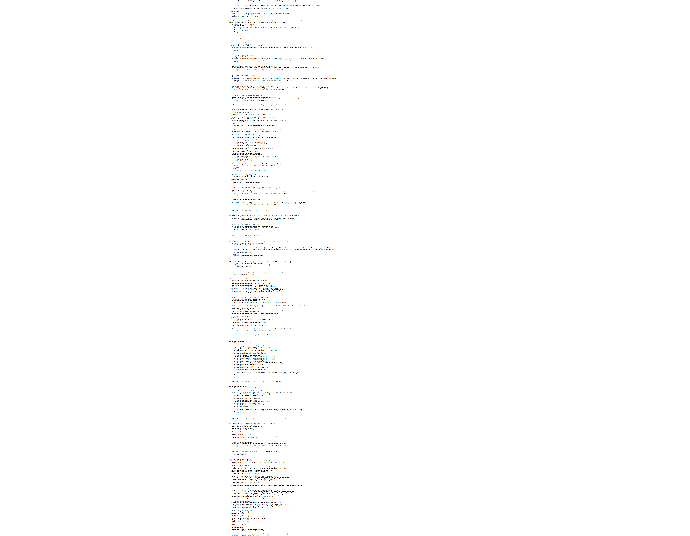
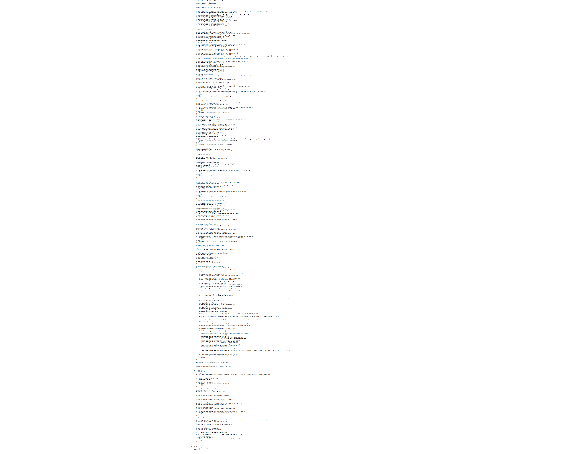

<style>
div.twocols {
  margin-top: 35px;
  column-count: 2;
}
div.twocols p:first-child,
div.twocols h1:first-child,
div.twocols h2:first-child,
div.twocols ul:first-child,
div.twocols ul li:first-child,
div.twocols ul li p:first-child {
  margin-top: 0 !important;
}
div.twocols p.break {
  break-before: column;
  margin-top: 0;
}
</style>

# Fractals on the GPU
## By Alex Loiko


https://github.com/aleloi/juliagpu/

<!---
rendering fractals on a graphics accelerator.

math - re-implement

graphics coding - I tried a few low-level graphics programming frameworks.
-->


---

# Why fractals?
<!-- WHY?: could have been many other things that how to interact with the GPU-->
* Simple algorithm and looks good 
<!--  tradeoff between complex rendering alg and nice result. With relatively little effort you make a computer do something you couldn't do before and are still in control!-->
* Utilizes your GPU 
<!--(in an interesting and non-trivial way - both GPGPU compute and rendering)-->




---
# Simplest version, black and white




<!--
The code to generate the image in the last slide is very simple:

you first pick a complex number c, and you'll get different images for different values of c. 
If you change it smoothly, you get an animated fractal

Then for each pixel you run a loop. First convert the pixel to a complex coordinate (it's not shown, but it's the input to `in_set` below).


Then you make a function f that dose z goes to z^2 + c - see it captures c by reference.

Then in the loop that you do per-pixel, you iteratively apply f to the complex coordinate until it gets large.


-->


```cpp
using C = std::complex<double>;
const C c = -0.4 + 0.6i;
auto f = [&c](const C& z) -> C {
  return z * z + c; 
};
auto color = [&f](const C& z)
                    -> Color {
  C current = z;
  for (int i = 0; i < 50; ++i) {
    current = f(current);
    if (std::norm(current) > 4.0) {
      return Color::BLACK;
    }
  }
  return Color::WHITE;
};
```


---

# Math

<!--

Note there are  discrepencies - the code above iterated until a point had larger norm than 4, this definition says you have to go all the way to infinity and 
check whether the sequence grows to infinity.

-->
The Julia set of the function $f(z) = z^2 + c$ is the set of all $z\in\mathbb{C}$ such that the sequence

$$|z|,\ |f(z)|,\ |f(f(z))|,\ |f(f(f(z)))|,\ldots$$

is bounded.

---
# Colors


---
# Colors

Keep track of how many iterations it takes for a point to escape the $|z|<2$ region. Map the iteration number to a color.

<div class="twocols">


## Old

```cpp
auto color = [&f](const C& z)
                    -> Color {
  C current = z;
  for (int i = 0; i < 50; ++i) {
    current = f(current);
    if (std::norm(current) > 4.0) {
      return Color::BLACK;
    }
  }
  return Color::WHITE;
};
```

## New

```cpp
auto color = [&f](const C& z)
                    -> Color {
  C current = z;
  for (int i = 0; i < 50; ++i) {
    current = f(current);
    if (std::norm(current) > 4.0) {
      return iter2col(i);
    }
  }
  return iter2col(50);
};
```
</div>

---

# Not mentioned:
* Smooth colors
* Removing color flickering during movement
* Very deep iteration and float precision

---


# Graphics frameworks

<div class="twocols">

## Vulcan


- Low level
- Aimed at game engine developers
- Very much initial setup

<p class="break"> </p>

<!-- Built for js in browser, but there is a spec and a C header autogenerated from the spec.
Two implementations 
-->
## WebGPU - Dawn and wgpu
- Spec developed for the browser
- Rust and C++ implementations


</div>

---



---



---



---



---

# VERY brief intro to WebGPU

* Special language WGSL for "shaders"
* Shaders are part of: Write shaders → Compile → Build pipelines → Bind resources
* **Compute + Graphics**: Run fractal math on GPU, then render to screen

```rust
@compute @workgroup_size(16, 16)
fn main(@builtin(global_invocation_id) global_id: vec3<u32>) {
  // Julia set iteration per pixel
  let real = params.viewX + (f32(x) / f32(width)) * params.viewWidth;
  var zr: f32 = real;
  var zi: f32 = imag;
  while (iter < maxIterations && zr*zr + zi*zi < 4.0) {
    zi = 2.0 * zr * zi + ci;
    zr = zr*zr - zi*zi + cr;
    iter += 1u;
  }
}
```

---

<!---
Not a slide, remove (and fix this)!
-->

# TODO coding
- build system that I'm not THAT ashamed of
- gh repo
- BENCHMARK and graphs!

---

# Real math with real notation

For any complex function $f$, the Julia set $J_f$ is defined by

$$J_f = \left\{ z\in C : \ \sup_{n} |f^{[n]}(z)|<\infty \right\}$$